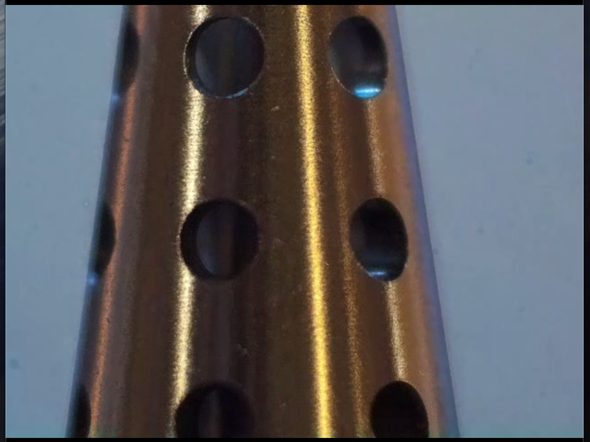
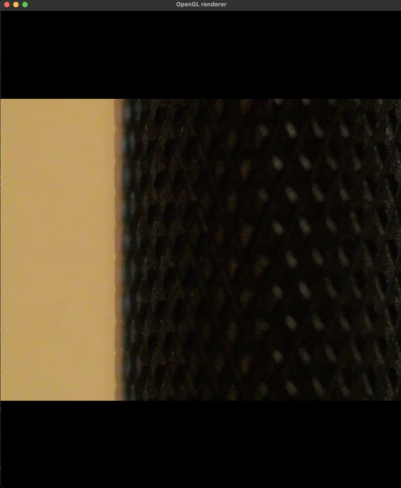

# efxbuild
from ef builders retreat in calistoga jan-feb25

w/ logan murray

using a rpi4 with a hq camera with a telescopic lens to do pixel-height conversion. set up the crontab etc. uses openGL to render

test scripts send a bouncing ball dvd-style around the screen to check the gstreamer link. make sure you adjust the port settings and the ip address accordingly. test with the test scripts then use rpi_gs_stream.sh and pc_receive.sh to be off to the races

see below test image of soldering iron and setup

and of knurling in an ifixit screwdriver and setup ft. oleg

 

hooray

also check out https://deptoffense.space
